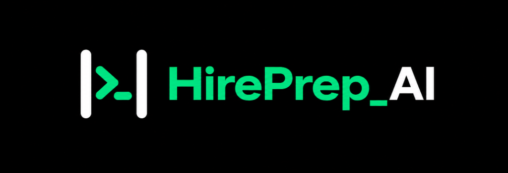
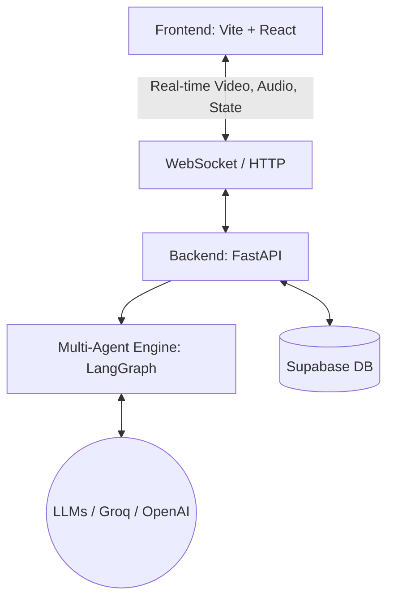
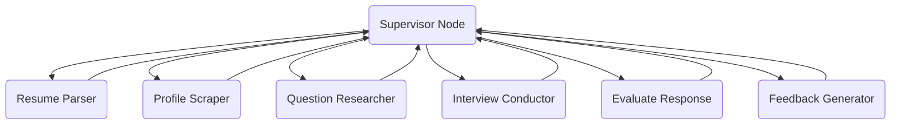

<p align="center">
  
</p>

> Autonomous Multi-Agent AI Mock Interview Platform powered by **FastAPI** and **LangGraph**.

# HirePrep AI 🚀

HirePrep AI is a state-of-the-art **Autonomous Multi-Agent Mock Interview Platform** designed to simulate real-world, high-bar technical interviews. Driven by a LangGraph multi-agent backend, the platform dynamically tailors its questions, difficulty, and follow-ups based on the candidate's resume, coding profiles (GitHub, LeetCode, Codeforces), and real-time performance.

---

## 🌟 Key Features
| Feature | Description |
|---|---|
| **Dynamic Multi-Agent Backend** | Orchestrates specialized AI agents (Resume Parser, Web Researcher, Interview Conductor, Evaluator, Feedback Generator) via LangGraph for an adaptive flow. |
| **Resume-Grounded Questions** | Extracts skills/projects from uploaded resumes to conduct contextual "deep dive" behavioral and architectural rounds. |
| **Real-Time Coaching & Empathy** | Interview Conductor tracks time, detects emotional struggles, catches logic errors mid-thought, and redirects from tangents. |
| **Web Intelligence Scraping** | Scrapes the web for company-specific constraints, aligning questions with target company values (e.g., Amazon Leadership Principles). |
| **Proctoring & Anti-Cheat** | Front-end computer vision and event-tracking detects tab switches, copy-paste attempts, and evaluates candidate eye contact/confidence. |
| **Interactive Whiteboard & Code Sandbox** | Features a live React-Flow whiteboard for system design and an AST-based Python code execution sandbox. |
| **Comprehensive 14-Day Roadmap** | Generates an actionable, personalized improvement roadmap based on specific concept gaps identified during the mock interview. |

---

## 💻 Tech Stack

| Domain | Technologies Used |
|---|---|
| **Frontend** | React 18, Vite, TailwindCSS, Monaco Editor, React-Flow, WebRTC |
| **Backend** | Python 3.10+, FastAPI, WebSockets |
| **AI / Multi-Agent Engine** | LangGraph, LiteLLM (Groq: LLaMA-3, Qwen; Gemini API: Gemini 2.5 Flash) |
| **Data / Auth** | Supabase (PostgreSQL, Row Level Security, Auth) |
| **Code Execution** | Custom AST Sandbox / Remote Code Execution integrations |

---

## 🏗 High-Level Architecture



The platform operates on a robust client-server architecture:

1. **Frontend (Vite + React + TailwindCSS):** 
   A high-performance Single Page Application (SPA) providing real-time WebRTC audio visualization, React-Flow diagramming, Monaco Editor for coding, and WebSocket integration for low-latency interview interactions.
   
2. **Backend (FastAPI + LangGraph):** 
   An asynchronous, event-driven Python backend utilizing WebSockets for duplex communication. LangGraph manages the state machine and routes context between five specialized AI agents.

---

## 🧠 Low-Level Agent Architecture (LangGraph)



The core intelligence is powered by a cyclic graph of specialized agents operating on a shared `InterviewState`:

- **Agent 1: Resume Parser:** Ingests PDF/DOCX resumes, extracting experience levels, project tech stacks, and coding profile links.
- **Agent 2: Profile Aggregator:** Asynchronously scrapes GitHub, LeetCode, and Codeforces to synthesize a candidate capability profile.
- **Agent 3: Question Researcher:** Uses Tavily search to pull real-time company engineering blogs and recent interview reports to ground question generation.
- **Agent 4: Interview Conductor:** The "Human Interface". Manages conversational bridging, empathy, time awareness, Reverse Q&A, and delivers adaptive hints.
- **Agent 5: Response Evaluator:** Analyzes candidate intent (Hint Request, Clarification, Answer). Grades depth, identifies concept gaps, enforces the STAR behavioral framework, and provides live logic correction.
- **Agent 6: Feedback Generator:** Compiles the holistic performance data into a detailed rubric, combining integrity scores, camera metrics, and LLM-synthesized roadmaps.

---

## 📡 API Reference

Below is a non-exhaustive list of the core FastAPI endpoints exposed by the backend:

| Method | Endpoint | Description |
|---|---|---|
| **Auth & Profile** |
| `GET` | `/api/auth/me` | Fetches candidate profile and aggregated interview stats. |
| `POST` | `/api/auth/sync` | Synchronizes user data with the FastAPI backend UserModel. |
| `PUT` | `/api/auth/profile` | Updates candidate career preferences and coding profiles. |
| `DELETE` | `/api/auth/account` | Permanently deletes the candidate's account and data. |
| **Resume & Scraping** |
| `POST` | `/api/resume/upload` | Uploads a resume file (PDF/DOCX) for AI parsing. |
| `GET` | `/api/resume/latest` | Fetches the user's latest parsed resume if available. |
| `POST` | `/api/profile/scrape-from-resume/{resume_id}` | Triggers async scraping of coding profiles identified in a resume. |
| `GET` | `/api/profile/github/{username}` | Scrapes a specific GitHub profile. |
| **Interview Engine** |
| `POST` | `/api/interview/start` | Initializes a new AI mock interview session tailored to the resume and company. |
| `GET` | `/api/interview/{id}` | Fetches an ongoing or completed interview session by ID. |
| `GET` | `/api/interview/history` | Fetches past interview session history for the candidate. |
| `POST` | `/api/interview/{id}/code` | Evaluates candidate code in the AST Python sandbox. |
| `POST` | `/api/interview/{id}/diagram` | Submits candidate's architecture whiteboard diagram for evaluation. |
| `WS` | `/api/interview/ws/{id}` | **WebSocket connection for live, duplex streaming of the interview conversation.** |
| **Feedback & Analytics** |
| `GET` | `/api/feedback/{id}` | Retrieves the comprehensive feedback report for an interview session. |
| `POST` | `/api/feedback/{id}/generate` | Manually triggers LangGraph feedback report generation. |
| `GET` | `/api/feedback/user/history` | Retrieves a history of all feedback reports. |
| `GET` | `/api/feedback/analytics/summary` | Retrieves candidate analytics overview (trends, radar, strengths). |

---

## 📂 Project Structure

```
HirePrep_AI/
├── backend/
│   ├── app/
│   │   ├── graph/           # LangGraph Agent Nodes and State Definitions
│   │   ├── models/          # Pydantic Schemas for validation
│   │   ├── routes/          # FastAPI REST and WebSocket Endpoints
│   │   ├── services/        # Business Logic (LLMs, Scrapers, AST execution)
│   │   ├── utils/           # Helper utilities
│   │   ├── main.py          # FastAPI Application Entrypoint
│   │   └── config.py        # Environment Configuration
│   ├── tests/               # Pytest Unit and Integration Tests
│   └── requirements.txt     # Python Dependencies
├── frontend/
│   ├── src/
│   │   ├── components/      # Reusable React UI Components
│   │   ├── lib/             # Supabase Config and API wrappers
│   │   ├── pages/           # Route Pages (Dashboard, InterviewRoom, etc.)
│   │   ├── styles/          # Vanilla CSS and Design System variables
│   │   └── App.jsx          # React Router Setup
│   ├── package.json         # NPM Dependencies
│   └── vite.config.js       # Vite Bundler Configuration
└── README.md                # You are here!
```

---

## 🚀 Setup & Run Instructions

### Prerequisites
- Node.js (v18+)
- Python (3.10+)
- LLM API Keys (Groq / Gemini / HuggingFace / OpenRouter)
- Supabase Account (for Auth and Database)

### 1. Backend Setup

1. **Navigate to the backend directory:**
   ```bash
   cd backend
   ```
2. **Create a virtual environment and install dependencies:**
   ```bash
   python -m venv venv
   # Windows:
   venv\Scripts\activate
   # macOS/Linux:
   source venv/bin/activate
   pip install -r requirements.txt
   ```
3. **Configure Environment Variables:**
   Copy `.env.example` to `.env` and fill in your API keys (e.g., `OPENAI_API_KEY`, `TAVILY_API_KEY`).
4. **Run the FastAPI Server:**
   ```bash
   uvicorn app.main:app --reload --host 0.0.0.0 --port 8000
   ```

### 2. Frontend Setup

1. **Navigate to the frontend directory:**
   ```bash
   cd frontend
   ```
2. **Install dependencies:**
   ```bash
   npm install
   ```
3. **Configure Environment Variables:**
   Create a `.env` file in the `frontend` folder containing your Supabase URL and Anon Key:
   ```env
   VITE_SUPABASE_URL=your_supabase_url
   VITE_SUPABASE_ANON_KEY=your_anon_key
   VITE_API_URL=http://localhost:8000
   ```
4. **Start the Vite Development Server:**
   ```bash
   npm run dev
   ```

You can now navigate to `http://localhost:5173` to access the HirePrep AI application!

---

## 📄 License

MIT License

Copyright (c) 2026 HirePrep AI

Permission is hereby granted, free of charge, to any person obtaining a copy
of this software and associated documentation files (the "Software"), to deal
in the Software without restriction, including without limitation the rights
to use, copy, modify, merge, publish, distribute, sublicense, and/or sell
copies of the Software, and to permit persons to whom the Software is
furnished to do so, subject to the following conditions:

The above copyright notice and this permission notice shall be included in all
copies or substantial portions of the Software.

THE SOFTWARE IS PROVIDED "AS IS", WITHOUT WARRANTY OF ANY KIND, EXPRESS OR
IMPLIED, INCLUDING BUT NOT LIMITED TO THE WARRANTIES OF MERCHANTABILITY,
FITNESS FOR A PARTICULAR PURPOSE AND NONINFRINGEMENT. IN NO EVENT SHALL THE
AUTHORS OR COPYRIGHT HOLDERS BE LIABLE FOR ANY CLAIM, DAMAGES OR OTHER
LIABILITY, WHETHER IN AN ACTION OF CONTRACT, TORT OR OTHERWISE, ARISING FROM,
OUT OF OR IN CONNECTION WITH THE SOFTWARE OR THE USE OR OTHER DEALINGS IN THE
SOFTWARE.
